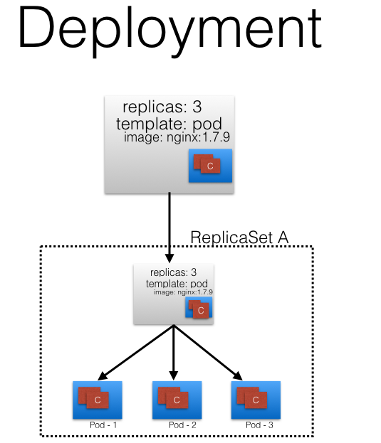
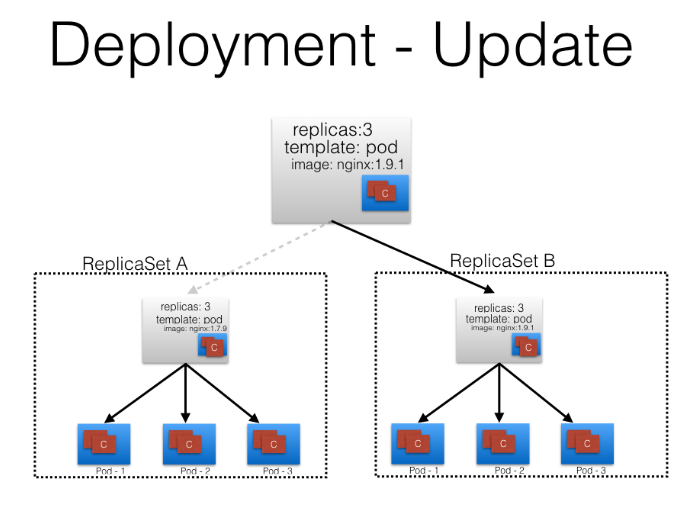
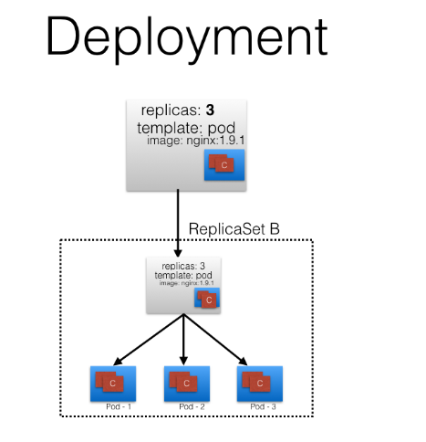

# Kubernetes Object Model

To create an object, we need to provide `spec` field to kubernetes API server.Each object that you store has three parts: the metadata , a specification and the current observed status. As a user, you have to provide the metadata, and a specification in which you describe the desired state of the object

## Pods
pod is a smallest unit of kubernetes object. pod is a collection of containers which shares network namespace and volumes.
pods are ephemeral in nature, they cannot self heal self heal themselves.

## Labels
labels are key-value pair that can be attached to any Kubernetes objects
Using Label Selectors we can select subset of objects
Equality Based Selectors: Filtering of objects based on label keys and values 
e.g. env==dev, we are selecting the objects where the env label is set to dev
Set Based Selectors: Filtering of objects  	
e.g with env in (dev,qa), we are selecting objects where the env label is set to dev or qa

## ReplicaSets
Replication controller is a part of kube-controller-manager, It makes sure the specified number of replicas for a pod is running at any
given point of time.
Replication controller only supports equality based selectors.
Replica set is more advanced then replication controller, It supports both type of selectors 

## Deployments
It is also part of kube-controller-manager, With Kubernetes Deployments, you “describe a desired state in a Deployment object, and the Deployment controller changes the actual state to the desired state. Kubernetes deployments manage stateless services running on your cluster. Their purpose is to keep a set of identical pods running and upgrade them in a controlled way – performing a rolling update by default

In the following example, we have a Deployment which creates a ReplicaSet A. ReplicaSet A then creates 3 Pods. In each Pod, one of the containers uses the nginx:1.7.9 image.

Now, in the Deployment, we change the Pod's template and we update the image for the nginx container from nginx:1.7.9  to nginx:1.9.1. Ashave modified the Pod's template, a new ReplicaSet B gets created. This process is referred to as a Deployment rollout

Once ReplicaSet B is ready, the Deployment starts pointing to it.

## Namespaces
To achieve multitenancy or to organize k8s cluster in projects and teams namespaces are used. we can partition the Kubernetes cluster into sub-clusters using Namespaces. Kubernetes creates two default namespaces: kube-system and default. The  kube-system namespace contains the objects created by the Kubernetes system. The default namespace contains the objects which belong to any other namespace.
'kubectl get namespaces'

Using Resource Quotas, we can divide the cluster resources within Namespaces. We will briefly cover Resource Quotas in one of the future chapters.

## Services
To access the application, a user/client needs to connect to the Pods. As Pods are ephemeral in nature, resources like IP addresses allocated to it cannot be static. Pods could die abruptly or be rescheduled based on existing requirements.

Let's take, for example, a scenario in which a user/client is connected to a Pod using its IP address.
Unexpectedly, the Pod to which the user/client is connected dies, and a new Pod is created by the controller. The new Pod will have a new IP address, which will not be known automatically to the user/client of the earlier Pod.
To overcome this situation, Kubernetes provides a higher-level abstraction called Service, which logically groups Pods and a policy to access them. This grouping is achieved via Labels and Selectors

For example, in the following graphical representation we have used the app keyword as a Label, and frontend and db as values for different Pods.

Using Selectors (app==frontend and app==db), we can group them into two logical groups: one with 3 Pods, and one with just one Pod.  
We can assign a name to the logical grouping, referred to as a service name. In our example, we have created two Services, frontend-svc  and db-svc, and they have the app==frontend and the app==db Selectors, respectively.

